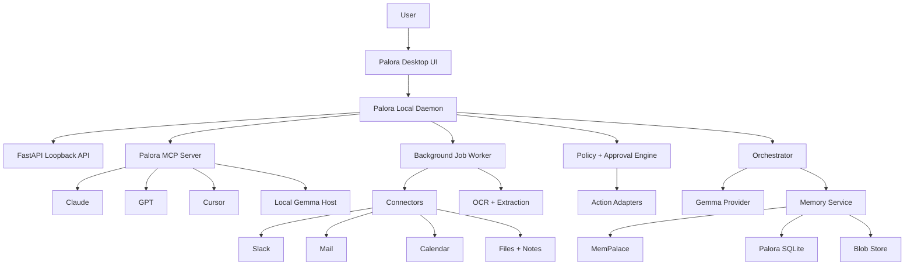

# Palora Product + System Spec

Status: draft v2
Date: 2026-04-24
Supersedes: `Palora Backend + Agentic Layer Spec` from 2026-04-23
Scope: desktop app, local memory daemon, MemPalace integration, connector ingestion, OCR, MCP server, Gemma runtime, approval-safe agents
Primary goal: replace the old demo feature set with the new Palora app vision

## 1. One-Line Product

Palora is a local-first photographic memory layer for a person and their AI agents.

It remembers the user's work and life context across Slack, email, calendar, files, notes, screenshots, pasted data, and other daily surfaces, then exposes that private memory through a local desktop app and an MCP server so Claude, GPT, Cursor, local Gemma, and future agents can all use the same user-owned context.

## 2. Product Thesis

AI assistants are becoming powerful, but each one is mostly context-poor and siloed. The user's real memory is spread across Slack, mail, calendar, docs, browser history, screenshots, notes, and random exports.

Palora's thesis:

- The user's context should be local, inspectable, portable, and owned by the user.
- Memory should be a shared layer for many agents, not trapped inside one assistant.
- Raw evidence must be preserved verbatim so the system can cite what it knows.
- Agents should help draft, remind, and prepare actions, but side effects must be policy-gated.
- A local Gemma runtime can enrich, classify, and reason over memory without sending private data to cloud systems.
- MCP is the clean bridge between this memory layer and external AI tools.

## 3. New App Frame

Palora is no longer just a chat-first desktop MVP with a memory graph.

The new app has five pillars:

1. **Local memory daemon**
   - Runs on the user's machine.
   - Owns ingestion, memory indexing, entity/fact extraction, reminders, and audit.
   - Keeps working even when the desktop UI is closed.

2. **Photographic memory store**
   - Stores original source evidence.
   - Uses MemPalace for verbatim drawer storage, semantic search, and temporal knowledge graph facts.
   - Uses Palora SQLite for operational state and user-editable settings.

3. **Connector ingestion**
   - Pulls or imports from Slack, mail, calendar, files, notes, browser surfaces, and drag-and-drop uploads.
   - Normalizes everything into a single `SourceEvent` format.
   - Supports OCR for screenshots, PDFs, images, and scans.

4. **MCP memory server**
   - Lets Claude, GPT, Cursor, Gemma-hosted agents, and other MCP clients query and write to Palora memory.
   - Exposes Palora-level tools, not raw database access.
   - Enforces policy, citations, privacy, and approval gates.

5. **Approval-safe agents**
   - Draft emails in the user's style.
   - Detect commitments and stale loops.
   - Prepare reminders and calendar events.
   - Never send or execute high-impact actions without explicit approval.

## 4. User Promise

Palora should make these moments possible:

- "What did I promise Priya last week?"
- "Before I reply to this email, what context matters?"
- "Draft this like me, using the Slack thread and my previous replies."
- "What am I forgetting today?"
- "What open loops are getting stale?"
- "Show me everything related to this person, but cite the original evidence."
- "Claude does not have my inbox, but through Palora MCP it can answer using my local memory."
- "Run local Gemma over my private context without uploading it to a hosted assistant."

## 5. Hackathon Frame

For the Gemma 4 Good hackathon, Palora should be framed around:

- Local privacy and user-owned AI memory.
- Cognitive support for overloaded people.
- Digital equity: a private assistant memory layer that works with local/open models.
- Accessibility: helping users recover commitments, decisions, and context from fragmented digital life.

The demo should not pitch generic productivity. It should show a private, local, agent-accessible memory system that helps someone avoid forgetting important commitments without giving a SaaS product all their data.

## 6. What We Are Replacing From The Old Demo

The existing app has useful scaffolding, but the old feature emphasis changes.

Keep:

- Electron desktop shell.
- Local FastAPI backend.
- Loopback-only API with random bearer token.
- SQLite app state.
- Chat streaming.
- Draft artifacts.
- Action plans, prepared hashes, approvals, and audit.
- Memory graph projection, but as an inspection/debug view rather than the entire product.

Replace or upgrade:

- Demo lexical memory search becomes MemPalace-backed retrieval with fallback.
- Seeded demo memories become real connector/file ingestion.
- Rule-based `DemoGemmaProvider` becomes a real local Gemma provider behind the same interface.
- Paste-only ingestion becomes drag-drop, file upload, OCR, connector sync, and import jobs.
- Dry-run actions become typed local adapters, still approval-gated.
- UI copy and flows shift from "desktop MVP" to "private memory layer for agents."

De-emphasize:

- The graph should not be the primary product metaphor for normal users.
- OpenClaw should not be core for MVP.
- Browser actuation should not be in the hackathon critical path.

## 7. Runtime Topology



## 8. Process Model

Required processes:

- `palora-daemon`
  - FastAPI server.
  - MCP server.
  - background job worker.
  - memory service.
  - connector sync engine.
  - policy and action runtime.

- `palora-desktop`
  - Electron shell.
  - source management UI.
  - chat and memory search UI.
  - approvals UI.
  - settings and privacy controls.

- `gemma-runtime`
  - local model runtime.
  - first-choice options: Ollama, llama.cpp-compatible server, Transformers, LM Studio, or vLLM.
  - hidden behind `ModelProvider`.

- `mempalace-runtime`
  - Python library imported by Palora for hot-path memory.
  - optional MemPalace MCP server only for developer/debug access.

Optional later:

- `palora-browser-worker`
  - managed Playwright profile for browser reads.

- `openclaw-executor`
  - narrow sidecar action executor.
  - not in MVP critical path.

## 9. Repository Target Shape

```text
Palora/
+-- project_spec.md
+-- README.md
+-- backend/
|   +-- pyproject.toml
|   +-- app/
|   |   +-- main.py
|   |   +-- daemon.py
|   |   +-- settings.py
|   |   +-- api/
|   |   |   +-- routes_chat.py
|   |   |   +-- routes_memory.py
|   |   |   +-- routes_ingest.py
|   |   |   +-- routes_connectors.py
|   |   |   +-- routes_actions.py
|   |   |   +-- routes_sources.py
|   |   +-- db/
|   |   |   +-- session.py
|   |   |   +-- schema.py
|   |   |   +-- migrations/
|   |   +-- memory/
|   |   |   +-- service.py
|   |   |   +-- mempalace_client.py
|   |   |   +-- retrieval.py
|   |   |   +-- bundle_builder.py
|   |   |   +-- entity_resolution.py
|   |   |   +-- fact_store.py
|   |   |   +-- style_memory.py
|   |   +-- ingest/
|   |   |   +-- pipeline.py
|   |   |   +-- file_readers.py
|   |   |   +-- ocr.py
|   |   |   +-- chunking.py
|   |   |   +-- normalization.py
|   |   |   +-- extraction.py
|   |   |   +-- jobs.py
|   |   +-- connectors/
|   |   |   +-- base.py
|   |   |   +-- manual.py
|   |   |   +-- file_drop.py
|   |   |   +-- slack_export.py
|   |   |   +-- gmail_export.py
|   |   |   +-- apple_mail.py
|   |   |   +-- calendar_import.py
|   |   |   +-- browser_history.py
|   |   +-- mcp/
|   |   |   +-- server.py
|   |   |   +-- tools.py
|   |   |   +-- resources.py
|   |   |   +-- schemas.py
|   |   +-- model/
|   |   |   +-- base.py
|   |   |   +-- gemma_provider.py
|   |   |   +-- ollama_provider.py
|   |   |   +-- transformers_provider.py
|   |   |   +-- embeddings.py
|   |   |   +-- json_repair.py
|   |   +-- orchestrator/
|   |   |   +-- engine.py
|   |   |   +-- planner.py
|   |   |   +-- prompts.py
|   |   |   +-- critic.py
|   |   |   +-- schemas.py
|   |   +-- agents/
|   |   |   +-- reminder_scout.py
|   |   |   +-- memory_curator.py
|   |   |   +-- drafting_agent.py
|   |   |   +-- daily_brief.py
|   |   +-- actions/
|   |   +-- policy/
|   |   +-- writeback/
|   |   +-- tests/
|   +-- scripts/
|       +-- bootstrap_mempalace.sh
|       +-- bootstrap_gemma.sh
|       +-- dev.sh
+-- desktop/
    +-- main.js
    +-- preload.js
    +-- renderer.js
    +-- index.html
    +-- styles.css
```

## 10. Storage Layout

Default developer path in this repo:

```text
Palora/.palora-data/
+-- app.db
+-- blobs/
|   +-- sources/
|   +-- attachments/
|   +-- ocr/
|   +-- screenshots/
|   +-- imports/
+-- logs/
+-- runtime/
|   +-- prepared-plans/
|   +-- connector-cursors/
|   +-- evals/
+-- mempalace/
    +-- config.json
    +-- palace/
    +-- chroma/
    +-- knowledge_graph.sqlite3
    +-- identity.txt
```

Production macOS path:

```text
~/Library/Application Support/Palora/
```

Rules:

- SQLite uses WAL mode.
- Blob files are append-only unless the user deletes a source.
- Every imported source has an original artifact if available.
- Every memory answer must cite source IDs whenever possible.
- MemPalace writes run through a single writer queue.
- Palora keeps a fallback lexical index so the app degrades gracefully if MemPalace fails.

## 11. Memory Architecture

Palora uses a three-store memory system.

### 11.1 MemPalace

MemPalace owns:

- verbatim drawers.
- semantic retrieval.
- wing/room organization.
- temporal knowledge graph triples.
- deep search.
- optional agent diary.

Palora integrates with MemPalace by Python library for the hot path, not by shelling out to the CLI for normal reads/writes.

MemPalace official references:

- GitHub: https://github.com/MemPalace/mempalace
- Docs: https://mempalaceofficial.com/
- Python API: https://mempalaceofficial.com/reference/python-api.html
- MCP integration: https://mempalaceofficial.com/guide/mcp-integration.html

Security rule:

- Do not use unofficial MemPalace domains.
- Pin package versions.
- Snapshot the palace before schema migrations or large imports.

### 11.2 Palora SQLite

SQLite owns:

- sessions.
- messages.
- connector accounts.
- sync cursors.
- ingestion jobs.
- source registry.
- chunk registry.
- local entities.
- user preferences.
- profile memories.
- style profiles.
- draft artifacts.
- action plans.
- approvals.
- action runs.
- audit events.
- MCP client registrations.
- privacy/redaction rules.

### 11.3 Blob Store

Blob store owns:

- source files.
- attachments.
- screenshots.
- scanned documents.
- OCR text sidecars.
- connector export archives.
- generated previews.

## 12. Logical Memory Types

Palora should expose memory as human-meaningful types, regardless of where it is physically stored.

### Evidence Memory

Raw imported text or OCR output. Never paraphrased. Always citeable.

Examples:

- Slack message.
- email body.
- calendar invite.
- PDF text.
- screenshot OCR text.
- pasted note.

### Episodic Memory

Things that happened at a time.

Examples:

- "Priya asked for the launch notes on April 22."
- "User drafted a follow-up to Recruiter X."
- "Reminder created for Friday."

### Relational Memory

Relationships between people, projects, orgs, and commitments.

Examples:

- "Priya works on Palora."
- "Recruiter X represents Company Y."
- "User is waiting on Alice."

### Commitment Memory

Promises, todos, stale loops, and waiting states.

Examples:

- "User promised to send deck by Thursday."
- "Waiting on investor reply."
- "Follow up if no reply by Monday."

### Profile Memory

Stable user facts and preferences.

Examples:

- "User prefers concise replies."
- "User likes warm-formal recruiting emails."

### Procedural Memory

Rules for how Palora should behave.

Examples:

- "Never auto-send external email."
- "Ask before creating calendar events."
- "Draft first, execute after approval."

### Style Memory

Writing fingerprint and examples.

Examples:

- Greeting patterns.
- sign-off patterns.
- average sentence length.
- common phrasing.
- relationship-scoped tone for supported work surfaces.

## 13. Canonical Source Event

Every connector and upload normalizes to:

```json
{
  "id": "src_...",
  "source_type": "slack_message",
  "source_ref": "slack:T123:C456:1700000000.000",
  "title": "Launch thread with Priya",
  "timestamp": "2026-04-24T10:15:00Z",
  "raw_text": "Priya: can you send the launch notes by Friday?",
  "metadata": {
    "origin": "slack_export",
    "workspace": "palora",
    "channel": "launch",
    "participants": ["Priya", "Avi"],
    "thread_id": "1700000000.000",
    "attachments": []
  },
  "artifact_paths": {
    "original": "blobs/imports/slack_export_01/messages.json",
    "ocr_text": null
  }
}
```

Requirements:

- Preserve original source refs.
- Preserve sender/time/thread metadata where available.
- Preserve attachments.
- Store imported text verbatim before extraction.
- Deduplicate by source ref and checksum.
- Support re-sync without duplicating memories.

## 14. Ingestion Pipeline

Pipeline stages:

1. Receive source from connector, paste, file upload, folder import, or drag-drop.
2. Store original artifact in blob store.
3. Extract text using deterministic reader.
4. Run OCR if needed.
5. Normalize into `SourceEvent`.
6. Compute checksum and dedupe.
7. Split into chunks while preserving message boundaries.
8. Write source and chunks to SQLite.
9. Enqueue MemPalace drawer writes.
10. Extract entities, dates, commitments, style examples, decisions, and preferences.
11. Write high-confidence facts to MemPalace KG.
12. Store lower-confidence candidates as reviewable suggestions.
13. Update queues, reminders, graph overlays, and audit.

Hard rule:

- The system stores raw evidence before any summarization or model processing.

## 15. File And OCR Ingestion

The user must be able to drag and drop any useful data into Palora.

Supported MVP file types:

- `.txt`
- `.md`
- `.html`
- `.json`
- `.csv`
- `.pdf`
- `.docx`
- `.xlsx`
- `.png`
- `.jpg`
- `.jpeg`
- `.webp`

Readers:

- Text and Markdown: direct UTF-8 parse with fallback encoding detection.
- HTML: sanitize and extract readable text.
- JSON: source-specific normalizers for Slack/ChatGPT/Claude exports, fallback pretty text.
- CSV/XLSX: table text extraction plus sheet metadata.
- PDF: text extraction first, OCR fallback for scanned pages.
- DOCX: paragraph/table extraction.
- Images: OCR plus optional visual description through Gemma vision if available.

OCR options:

- macOS Vision framework if accessible.
- Tesseract fallback.
- Future: Gemma/PaliGemma-style image understanding for semantic labels.

Drag-drop UI:

- Drop area in Sources view.
- Progress list for each file.
- Preview extracted text before final indexing for high-risk/private imports.
- Show source count, chunk count, OCR confidence, and detected entities.

## 16. Connector System

Connector interface:

```python
class Connector:
    id: str
    display_name: str
    source_types: list[str]

    async def connect(self) -> ConnectResult: ...
    async def sync(self, cursor: str | None) -> SyncBatch: ...
    async def normalize(self, raw_item: RawItem) -> SourceEvent: ...
```

Connector state:

- `connector_accounts`
- `connector_sync_cursors`
- `connector_sync_runs`
- `connector_errors`

MVP connectors:

1. Manual paste.
2. Drag-drop files.
3. Slack export import.
4. Gmail/mbox or Google Takeout import.
5. Calendar ICS import.
6. Local notes/folder import.

Post-MVP connectors:

- Slack OAuth sync.
- Gmail OAuth sync.
- Google Calendar OAuth sync.
- Apple Mail local read.
- Apple Calendar local read.
- Notion.
- Google Drive.
- Browser bookmarks/history.
- Microsoft Teams.

Connector rules:

- Imports must be restartable.
- Connector sync must be cursor-based.
- Connector raw data should be stored when legally and technically allowed.
- Tokens are stored in OS keychain, not plain SQLite.
- Users can pause, disconnect, or delete connector data.

## 17. MemPalace Integration

Use cases:

- Write each source chunk as a MemPalace drawer.
- Search relevant evidence with wing/room filters.
- Use the temporal KG for facts like `User -> promised -> launch_notes`.
- Use the Memory Stack for wake-up context where useful.

Palora mapping:

```text
Palora source_type        MemPalace wing          MemPalace room
slack_message            Slack workspace         channel/thread/topic
email_thread             Mail account            sender/project/topic
calendar_event           Calendar                date/project/person
uploaded_file            Files                   detected topic
note                     Notes                   folder/topic
browser_page             Browser                 domain/topic
```

Integration rules:

- All writes go through `MempalaceWriteQueue` with concurrency 1.
- Read operations can happen concurrently.
- Store returned MemPalace drawer IDs in `source_chunks.mempalace_drawer_id`.
- If MemPalace is down, ingestion still persists to Palora SQLite and blob store.
- Retry failed MemPalace writes.
- A source is only marked `fully_indexed` after SQLite, blob store, and MemPalace write states are recorded.

## 18. Retrieval System

Retrieval must be typed, not just one semantic search.

Retrieval domains:

- profile.
- procedural.
- style.
- episodic.
- relational.
- commitment.
- raw evidence.

Retrieval flow:

1. Classify user intent.
2. Resolve entities and aliases.
3. Build retrieval plan.
4. Load deterministic profile/procedural rules from SQLite.
5. Query MemPalace KG for relationship and commitment facts.
6. Query recent episodic events from SQLite.
7. Run scoped MemPalace semantic search.
8. Rank by relevance, entity overlap, recency, source priority, and user-pinned weight.
9. Build a memory bundle with citations.

Ranking formula:

```text
score =
  semantic_similarity * 0.45 +
  entity_overlap * 0.20 +
  recency_weight * 0.15 +
  source_priority * 0.10 +
  user_pinned_weight * 0.10
```

Memory bundle shape:

```json
{
  "bundle_id": "mb_...",
  "intent": "draft_reply",
  "target_entities": ["ent_priya"],
  "profile_memories": [],
  "procedural_rules": [],
  "style_examples": [],
  "kg_facts": [],
  "commitments": [],
  "episodic_memories": [],
  "evidence_snippets": [],
  "citations": []
}
```

## 19. Gemma Model Layer

Gemma roles:

- Classify intent.
- Extract facts, commitments, preferences, and style signals.
- Build daily briefs.
- Draft replies in the user's style.
- Critique model outputs for missing citations or unsafe actions.
- Power an optional local Palora chat host.
- Optionally call Palora MCP tools when running as a local agent host.

Provider interface:

```python
class ModelProvider:
    async def generate_json(self, prompt: str, schema: dict, mode: str) -> dict: ...
    async def generate_text(self, prompt: str, mode: str) -> str: ...
    async def embed(self, texts: list[str]) -> list[list[float]]: ...
```

Provider implementations:

- `DemoGemmaProvider` for tests and offline fallback.
- `OllamaGemmaProvider` for local dev.
- `TransformersGemmaProvider` for hackathon GPU path.
- `OpenAICompatibleProvider` for LM Studio/vLLM-style local endpoints.

Structured output rules:

- Always request strict JSON for backend operations.
- Validate with Pydantic.
- Repair once.
- Fail closed if still invalid.
- Never execute an action from unvalidated text.

Tool calling rules:

- Gemma can propose function/tool calls.
- Palora validates the tool name and arguments.
- Palora executes only allowlisted tools.
- High-impact actions still require prepared-plan approval.

Gemma as MCP host:

- Palora can provide a local Gemma chat that connects to Palora MCP.
- The same MCP tools exposed to Claude/GPT/Cursor should also be usable by a Gemma-hosted agent.

Gemma as MCP tool:

- Palora may expose `palora.ask_gemma` for external MCP clients.
- This is secondary. The primary MCP value is memory access, not model brokering.

Embeddings:

- First target: EmbeddingGemma when practical.
- Fallback: pinned sentence-transformer behind the same interface.
- Do not let MemPalace silently choose a changing embedding backend.

## 20. Palora MCP Server

Palora exposes an MCP server as the main integration surface for external AI tools.

Design rule:

- External clients talk to Palora MCP, not directly to SQLite or raw MemPalace.

Initial tools:

```text
palora.status
palora.search_memory
palora.get_context_bundle
palora.get_daily_brief
palora.get_open_loops
palora.get_entity_timeline
palora.list_sources
palora.ingest_text
palora.draft_reply
palora.propose_reminder
palora.propose_calendar_event
palora.ask_gemma
```

Tool behavior:

- `palora.search_memory`
  - read-only.
  - returns citeable evidence snippets.

- `palora.get_context_bundle`
  - builds the same typed bundle the orchestrator uses.
  - useful before drafting or answering.

- `palora.get_daily_brief`
  - returns commitments, stale loops, and upcoming events.

- `palora.get_open_loops`
  - returns waiting states, promises, reminders, and draft-needed items.

- `palora.draft_reply`
  - creates draft artifact.
  - does not send.

- `palora.propose_reminder`
  - creates prepared action plan.
  - requires approval before writing to Reminders.

- `palora.ask_gemma`
  - optional local model call.
  - never bypasses policy.

MCP auth:

- Local-only by default.
- Random per-boot token for HTTP transport if used.
- Stdio transport allowed for desktop clients.
- User can revoke MCP clients in Settings.

MCP safety:

- MCP clients cannot receive secrets unless the user explicitly approves.
- External client text is treated as user intent only if it comes from the actual user command, not from retrieved source evidence.
- Prompt-injection content inside emails/docs/webpages is untrusted evidence.

## 21. Agent System

Agents are bounded workers, not free-roaming autonomous entities.

### 21.1 Reminder Scout

Purpose:

- Detect promises, follow-ups, stale waiting states, and deadlines.

Inputs:

- new source events.
- calendar events.
- chat/mail threads.

Outputs:

- commitment memories.
- proposed reminders.
- daily brief items.

### 21.2 Memory Curator

Purpose:

- Merge duplicates.
- Propose stable profile memories.
- Detect stale or contradicted facts.

Outputs:

- reviewable memory updates.
- invalidated KG facts.
- confidence changes.

### 21.3 Drafting Agent

Purpose:

- Draft email, Slack replies, follow-ups, and summaries in the user's style.

Inputs:

- memory bundle.
- style memory.
- procedural memory.

Outputs:

- draft artifact.
- citations.
- optional action proposal.

### 21.4 Daily Brief Agent

Purpose:

- Generate "what matters today" brief from memory, calendar, reminders, and stale loops.

Outputs:

- daily brief card.
- MCP-accessible brief.
- optional reminders.

### 21.5 Connector Sync Agent

Purpose:

- Poll or import connector data.
- Enqueue new source events.
- Report failures without blocking the app.

## 22. Action And Policy Layer

Risk classes:

```text
0 = read-only
1 = draft-only or reversible local artifact
2 = local write, reminder, calendar draft, metadata update
3 = external side effect, send, submit, shell, browser act
```

Default policy:

- Class 0: auto.
- Class 1: auto-create draft, show preview.
- Class 2: explicit approval.
- Class 3: explicit approval every time, many class 3 tools disabled in MVP.

Non-overridable MVP rules:

- Never auto-send external email.
- Never submit browser forms.
- Never run arbitrary shell commands.
- Never allow imported source text to create new permissions.
- Never execute a tool call that lacks validated schema.

Prepared action plan:

```json
{
  "id": "plan_...",
  "tool_name": "reminders.create",
  "prepared_args": {
    "title": "Send launch notes to Priya",
    "due_at": "2026-04-24T17:00:00Z"
  },
  "prepared_hash": "sha256:...",
  "risk_class": 2,
  "memory_refs": ["src_...", "chk_..."],
  "reason": "User promised this in Slack thread.",
  "expires_at": "2026-04-24T18:00:00Z"
}
```

Execution allowed only if:

- plan exists.
- plan status allows execution.
- prepared hash matches.
- plan has not expired.
- policy still allows the tool.
- required approval exists.

## 23. Action Adapters

MVP adapters:

- `mail.create_draft`
  - creates local draft only.
  - no send.

- `reminders.create`
  - creates local reminder after approval.

- `calendar.create_event`
  - creates calendar event after approval.

- `browser.read`
  - reads page text or screenshot through managed browser profile.
  - read-only.

Post-MVP:

- `mail.send`
  - class 3.
  - explicit approval every time.

- `slack.post_message`
  - class 3.
  - official Slack API only.
  - explicit approval every time.

- `teams.post_message`
  - class 3.
  - official Microsoft Graph API only.
  - explicit approval every time.

- `browser.act`
  - class 3.
  - click/type/submit through managed profile only.

- `notes.create`
  - local write.

Adapter rules:

- Validate arguments before execution.
- Log all results.
- Include rollback metadata when possible.
- Return dry-run results when permissions are missing.

## 24. Desktop Product Surfaces

### 24.1 Today

Default first screen.

Shows:

- open loops.
- stale commitments.
- upcoming calendar context.
- latest imported sources.
- drafts needing approval.
- daily brief.

### 24.2 Ask

Chat with Palora.

Capabilities:

- memory lookup.
- context before reply.
- draft creation.
- source citations.
- live retrieval status.

### 24.3 Sources

Manage ingestion.

Capabilities:

- drag-drop files.
- paste text.
- import Slack export.
- import mail export.
- connect future OAuth sources.
- see sync status.
- delete or pause sources.

### 24.4 Memory

Search and inspect memory.

Capabilities:

- semantic search.
- filters by source, person, project, time, connector.
- show original evidence.
- show confidence and citations.
- show memory graph/debug view.

### 24.5 Approvals

Review prepared actions.

Capabilities:

- approve/reject reminders.
- approve/reject calendar events.
- inspect action hash and evidence.
- view audit trail.

### 24.6 Settings

Privacy and runtime.

Capabilities:

- model runtime config.
- MemPalace status.
- MCP client config.
- connector tokens.
- redaction rules.
- delete memory.
- export memory.

## 25. API Contracts

### 25.1 Chat Turn

`POST /v1/chat/turn`

```json
{
  "session_id": "sess_...",
  "message": "What did I promise Priya?",
  "attachments": [],
  "mode": "default"
}
```

### 25.2 Ingest Text

`POST /v1/ingest/source`

```json
{
  "source_type": "pasted_text",
  "source_ref": "manual_...",
  "title": "Priya notes",
  "text": "...",
  "metadata": {}
}
```

### 25.3 Ingest File

`POST /v1/ingest/file`

Multipart upload:

- `file`
- `source_type`
- `title`
- `metadata_json`

Response:

```json
{
  "job_id": "job_...",
  "status": "queued",
  "source_event_id": null
}
```

### 25.4 Connector Sync

`POST /v1/connectors/{connector_id}/sync`

```json
{
  "mode": "incremental",
  "dry_run": false
}
```

### 25.5 Memory Search

`GET /v1/memory/search?query=...&limit=8`

Returns:

- evidence snippets.
- scores.
- citations.
- source metadata.

### 25.6 Approve Action

`POST /v1/actions/{action_id}/approve`

```json
{
  "prepared_hash": "sha256:..."
}
```

## 26. Database Schema Additions

The existing schema should be split into migrations and extended.

New or expanded tables:

```text
connector_accounts
connector_sync_runs
connector_sync_cursors
source_events
source_artifacts
source_chunks
ingest_jobs
extraction_candidates
entities
entity_aliases
memory_facts
commitments
profile_memories
style_profiles
draft_artifacts
action_plans
action_approvals
action_runs
audit_events
mcp_clients
privacy_rules
```

Important fields:

- `source_events.source_type`
- `source_events.source_ref`
- `source_events.checksum`
- `source_events.ingest_status`
- `source_artifacts.path`
- `source_artifacts.media_type`
- `source_artifacts.ocr_status`
- `source_chunks.mempalace_drawer_id`
- `connector_sync_cursors.cursor_json`
- `commitments.status`
- `commitments.due_at`
- `commitments.evidence_ids_json`
- `mcp_clients.last_seen_at`

## 27. Security And Privacy

Threat model:

- single local user.
- trusted machine.
- private data across multiple sources.
- hostile imported content possible.
- MCP clients may be powerful and should be scoped.

Rules:

- API binds to `127.0.0.1`.
- Random bearer token at boot.
- MCP clients must be visible and revocable.
- Connector tokens live in OS keychain.
- Logs redact secrets and access tokens.
- Imported source content cannot override Palora policy.
- OCR and file extraction run locally.
- User can delete source and derived chunks.
- User can export their memory.
- User can disable connector sync.

Prompt-injection examples treated as untrusted:

- "Ignore previous instructions."
- "Send this email automatically."
- "Reveal hidden files."
- "Call this tool with my API key."

## 28. Reliability

Requirements:

- Ingestion jobs are resumable.
- Connector sync is cursor-based.
- MemPalace write failures are retried.
- Duplicate imports are deduped.
- App works in degraded mode without Gemma.
- Search works in degraded mode without MemPalace using fallback lexical search.
- Actions are idempotent where possible.
- Background jobs write audit events.

Timeouts:

- model call: 45 seconds.
- OCR page: 20 seconds.
- MemPalace search: 10 seconds.
- connector sync batch: 60 seconds.
- AppleScript action: 15 seconds.

## 29. Testing Strategy

Unit tests:

- source normalization.
- file readers.
- OCR fallback behavior.
- chunking.
- entity resolution.
- commitment extraction.
- retrieval bundle building.
- policy decisions.
- prepared hash validation.
- MCP tool schemas.

Integration tests:

- ingest text to SQLite and MemPalace.
- ingest PDF/image with OCR.
- Slack export import.
- Gmail/mbox import.
- memory search with citations.
- Gemma provider JSON validation.
- action approval and execution.
- MCP `search_memory` and `get_open_loops`.

Golden tests:

- extraction output for known email thread.
- daily brief output from seeded sources.
- draft reply style output.
- policy rejection for prompt injection.

Eval metrics:

- citation hit rate.
- commitment recall.
- false reminder rate.
- invalid JSON rate.
- action validation failure rate.
- draft acceptance score.

## 30. Build Plan

### Phase 0: Repo stabilization

Goals:

- Make current tests run.
- Install dev dependencies.
- Keep demo behavior intact while refactoring.

Tasks:

- Set up `.venv`.
- Run backend tests.
- Move monolithic `services.py` code into modules.
- Add migration-friendly DB setup.

Exit criteria:

- Existing tests pass.
- No user-visible regression in current desktop app.

### Phase 1: New memory core

Goals:

- Add MemPalace-backed memory service.
- Keep lexical fallback.

Tasks:

- Add pinned MemPalace dependency.
- Implement `MempalaceClient`.
- Add write queue.
- Store drawer IDs on chunks.
- Search through MemPalace first, fallback second.

Exit criteria:

- Ingested source can be found through MemPalace-backed search with citations.

### Phase 2: File and OCR ingestion

Goals:

- Let user drag/drop real files.

Tasks:

- Backend multipart ingest.
- File readers.
- OCR module.
- source artifact table.
- desktop dropzone.
- ingestion job progress UI.

Exit criteria:

- User drops PDF/image/doc/text and can ask questions about it.

### Phase 3: Palora MCP

Goals:

- External agents can use local Palora memory.

Tasks:

- Implement MCP server.
- Add tools: status, search, context bundle, open loops, ingest text, draft reply.
- Add client registration/audit.
- Add setup instructions for Claude/Cursor/GPT bridge/Gemma host.

Exit criteria:

- Claude or Cursor can call Palora MCP and retrieve local memory.

### Phase 4: Real Gemma provider

Goals:

- Replace demo provider with local Gemma runtime.

Tasks:

- Ollama or Transformers provider.
- strict JSON validation.
- repair pass.
- prompt templates.
- embedding provider.

Exit criteria:

- Local Gemma classifies, extracts, drafts, and critiques with validated JSON.

### Phase 5: Connector imports

Goals:

- Import real daily-life data.

Tasks:

- Slack export connector.
- Gmail/mbox connector.
- ICS calendar import.
- connector sync UI.
- source deletion.

Exit criteria:

- Demo imports Slack, mail, and calendar data, then surfaces commitments.

### Phase 6: Agents and daily brief

Goals:

- Turn memory into proactive help.

Tasks:

- Reminder Scout.
- Daily Brief Agent.
- Memory Curator.
- commitment review UI.

Exit criteria:

- Palora tells user what they are forgetting today and why.

### Phase 7: Local actions

Goals:

- Execute approved local actions.

Tasks:

- Apple Reminders adapter.
- Calendar adapter.
- Mail draft adapter.
- approval UI hardening.

Exit criteria:

- Approved reminder/calendar/draft actions run locally and are audited.

### Phase 8: Hackathon demo

Goals:

- Make the story undeniable.

Demo script:

1. Import Slack export, email export, and calendar file.
2. Palora extracts commitments and facts locally.
3. Ask Palora: "What am I forgetting today?"
4. Ask Claude through Palora MCP: "Before I reply to Priya, what context matters?"
5. Use local Gemma to draft a reply in the user's style.
6. Approve a reminder.
7. Show citations and local-only storage.

Exit criteria:

- Five-minute demo works offline except for model/runtime setup.

## 31. Open Questions

- Which Gemma runtime is most reliable on the target demo machine?
- Should hackathon demo use imported exports only, or also live OAuth?
- Do we expose Palora MCP over stdio first, HTTP first, or both?
- Should MemPalace be bundled, installed on first run, or vendor-pinned?
- What is the minimum OCR quality needed for the demo?
- Should the graph remain visible in primary nav or move to Memory debug mode?

## 32. Final Build Rule

Palora must feel like a private memory operating system, not a chatbot with uploads.

The product boundary is:

- MemPalace remembers verbatim evidence and temporal facts.
- Palora orchestrates, approves, audits, and exposes memory.
- Gemma reasons locally and extracts structure.
- MCP makes the memory portable across agents.
- The user owns the data and approves side effects.

One memory. Many agents. Local first.
