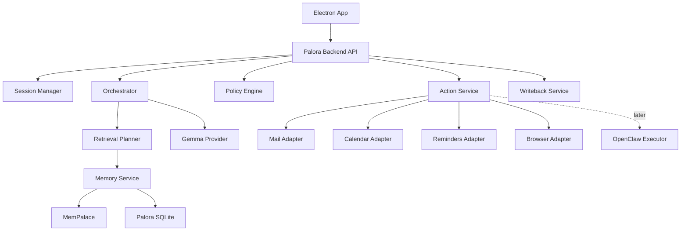
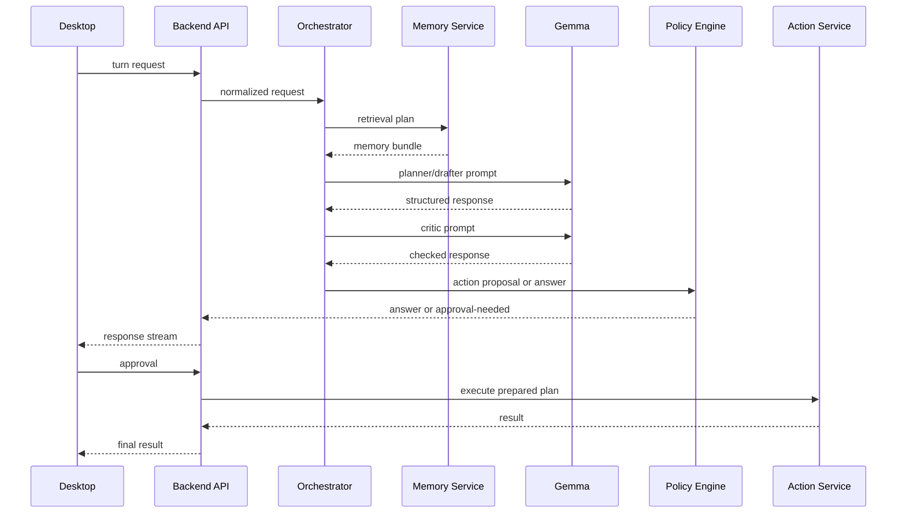

# Palora Backend + Agentic Layer Spec

Status: draft v1  
Date: 2026-04-23  
Scope: backend, memory, graph-serving APIs, agent runtime, policy, actions, ingestion  
Out of scope here: concrete renderer implementation, visual design, and frontend component tree.

## 1. Product Frame

Palora = one local-first desktop system for personal memory, reasoning, drafting, decision support, and approved action.

Internal split:

- MemPalace = raw evidence store, semantic retrieval, temporal knowledge graph
- Gemma = planner, drafter, critic, structured tool proposer
- Palora backend = source of truth for orchestration, policy, approvals, audit, writeback
- Local Mac adapters = action execution on this machine
- Optional later OpenClaw bridge = extra executor surface, not core architecture

Core rule:

Palora backend is brain. OpenClaw, if used later, is hands only.

## 2. Versioning Notes

Two implementation notes matter:

1. As of 2026-04-23, official Google docs show Gemma 4 overview and model card alongside function-calling and EmbeddingGemma docs. This spec still keeps `GemmaProvider` abstraction so model/runtime can change without changing orchestration architecture.
2. MemPalace public docs still show inconsistency on MCP tool count across docs surfaces and repo README. We will integrate against named APIs and library calls, not against tool-count assumptions.

## 3. Architectural Decision Summary

### 3.1 Chosen architecture

- Desktop shell: Electron
- Backend/orchestrator: Python 3.12 service
- Backend API: FastAPI over loopback only
- App metadata DB: SQLite in WAL mode
- Memory engine: MemPalace, pinned version, single-writer discipline
- LLM layer: Gemma family through local provider abstraction
- Embeddings: explicit embedding provider, not MemPalace implicit default
- Action execution: local Mac adapters first
- OpenClaw: optional v2 executor sidecar

### 3.2 Why this shape

This shape minimizes hackathon risk:

- MemPalace integration easiest in Python
- typed orchestration, validation, and writeback easier in Python
- Mac adapters can still run via `osascript`, Playwright, and local subprocesses from Python
- Electron only needs to talk to one local backend
- OpenClaw session/channel/gateway model stays outside MVP critical path

### 3.3 Explicit non-decisions

We are not doing these in MVP:

- full OpenClaw gateway as central runtime
- multi-tenant trust boundary
- multi-user accounts
- omnichannel messaging surfaces
- distributed worker fleet
- direct model-exec auto-send without policy gate
- remote browser control through OpenClaw node proxy
- user Chrome existing-session attach

## 4. High-Level Runtime Topology



## 5. Process Model

Local desktop app runs these processes:

### 5.1 Required

- `palora-backend`
  - FastAPI server
  - orchestrator
  - ingestion worker
  - action adapters
  - policy engine

- `model runtime`
  - local Gemma-compatible serving surface
  - recommended MVP: Ollama or llama.cpp-compatible HTTP server

- `MemPalace runtime`
  - same Python env as backend
  - imported as library for hot path
  - optional MCP server only for debug/external tooling

### 5.2 Optional later

- `openclaw gateway`
  - only if we decide to add sidecar executor
  - not required for backend MVP

## 6. Repository Structure

Initial repo shape:

```text
Palora/
├── project_spec.md
├── backend/
│   ├── pyproject.toml
│   ├── app/
│   │   ├── main.py
│   │   ├── settings.py
│   │   ├── api/
│   │   │   ├── routes_chat.py
│   │   │   ├── routes_actions.py
│   │   │   ├── routes_memory.py
│   │   │   └── routes_ingest.py
│   │   ├── orchestrator/
│   │   │   ├── engine.py
│   │   │   ├── intents.py
│   │   │   ├── planner.py
│   │   │   ├── critic.py
│   │   │   ├── prompt_builder.py
│   │   │   └── schemas.py
│   │   ├── memory/
│   │   │   ├── mempalace_client.py
│   │   │   ├── retrieval.py
│   │   │   ├── bundle_builder.py
│   │   │   ├── entity_resolution.py
│   │   │   └── style_memory.py
│   │   ├── ingest/
│   │   │   ├── pipeline.py
│   │   │   ├── chunking.py
│   │   │   ├── entity_extraction.py
│   │   │   ├── fact_extraction.py
│   │   │   ├── style_extraction.py
│   │   │   └── jobs.py
│   │   ├── actions/
│   │   │   ├── base.py
│   │   │   ├── mail_draft.py
│   │   │   ├── calendar_event.py
│   │   │   ├── reminders.py
│   │   │   ├── browser_managed.py
│   │   │   ├── shell_exec.py
│   │   │   └── openclaw_executor.py
│   │   ├── policy/
│   │   │   ├── engine.py
│   │   │   ├── risk.py
│   │   │   ├── approvals.py
│   │   │   └── prompt_injection.py
│   │   ├── model/
│   │   │   ├── base.py
│   │   │   ├── gemma_provider.py
│   │   │   ├── embeddings.py
│   │   │   └── repair.py
│   │   ├── db/
│   │   │   ├── models.py
│   │   │   ├── session.py
│   │   │   └── migrations/
│   │   ├── writeback/
│   │   │   ├── service.py
│   │   │   ├── episodic.py
│   │   │   ├── kg_updates.py
│   │   │   └── audit.py
│   │   ├── runtime/
│   │   │   ├── applescript.py
│   │   │   ├── jxa.py
│   │   │   ├── playwright_runner.py
│   │   │   └── prepared_plan.py
│   │   └── tests/
│   └── scripts/
│       ├── dev.sh
│       └── bootstrap_mempalace.sh
└── desktop/
    └── ...
```

## 7. Backend Source-of-Truth Rules

Canonical ownership by subsystem:

### 7.1 MemPalace owns

- raw imported evidence
- chunk-level semantic retrieval
- long-range recall
- temporal KG facts
- memory stack concepts
- optional agent diary

### 7.2 Palora app DB owns

- user-edited preferences
- policy rules
- style profile stats
- session state
- draft artifacts
- action proposals
- approvals
- audit records
- ingestion jobs
- idempotency keys

### 7.3 Why split this way

MemPalace excellent for verbatim memory and KG. Less ideal as only store for:

- user-editable settings
- operational state
- approval state
- deterministic workflow data

So Palora composes:

- unstructured memory from MemPalace
- structured operational truth from SQLite

## 8. Storage Layout

Recommended Mac paths:

```text
~/Library/Application Support/Palora/
├── app.db
├── blobs/
│   ├── sources/
│   ├── attachments/
│   └── screenshots/
├── browser/
│   └── managed-profile/
├── logs/
├── runtime/
│   ├── prepared-plans/
│   └── approvals/
└── mempalace/
    ├── mempalace.yaml
    ├── chroma/
    ├── knowledge_graph.sqlite3
    └── identity.txt
```

SQLite settings:

- WAL mode on
- `busy_timeout` set
- foreign keys on
- app DB snapshots before migrations
- MemPalace path isolated from app DB path

## 9. Core Backend Services

## 9.1 API Service

Responsibilities:

- authenticate local desktop client
- accept turn requests
- stream responses
- list pending approvals
- submit approvals/rejections
- start ingestion jobs
- expose audit and memory endpoints

Transport:

- loopback only `127.0.0.1`
- random port chosen at boot
- random bearer token generated by backend
- Electron main reads bootstrap JSON from backend stdout

Why not public localhost fixed port:

- lower accidental exposure
- avoid clashes
- easier local hardening

## 9.2 Session Manager

Responsibilities:

- create and resume user sessions
- store conversation turns
- track active entity focus
- maintain current draft context
- track pending action plans bound to session

Rules:

- one desktop user
- many sessions possible
- one active session in UI at a time
- action approval tied to exact session and exact prepared plan hash

## 9.3 Orchestrator Engine

Responsibilities:

- classify intent
- choose retrieval plan
- build model prompt
- parse structured model output
- run critic pass
- hand off action proposals to policy engine

This service is center of system.

## 9.4 Memory Service

Responsibilities:

- query MemPalace search
- query MemPalace KG
- query app DB profile/procedure/style state
- resolve entities and aliases
- rank and trim results
- return typed memory bundle

## 9.5 Policy Engine

Responsibilities:

- risk classify proposed actions
- block forbidden actions
- decide approval needed or not
- freeze canonical prepared plan
- emit approval request

## 9.6 Action Service

Responsibilities:

- validate prepared plan still valid
- dispatch to adapter
- normalize result
- attach audit metadata
- call writeback

## 9.7 Ingestion Service

Responsibilities:

- normalize imported content into `SourceEvent`
- chunk and dedupe
- persist raw evidence
- write evidence to MemPalace
- extract entities/facts/style
- enqueue writeback into KG and app DB

## 9.8 Writeback Service

Responsibilities:

- create episodic memories after each action
- update relationship facts
- store traces and outcome objects
- update status for promises and waiting states

## 10. App DB Schema

Main tables:

### `sessions`

- `id`
- `title`
- `created_at`
- `updated_at`
- `active_entity_id`
- `status`

### `messages`

- `id`
- `session_id`
- `role`
- `content`
- `structured_json`
- `created_at`
- `trace_id`

### `source_events`

- `id`
- `source_type`
- `source_ref`
- `timestamp`
- `title`
- `text_path`
- `metadata_json`
- `checksum`
- `ingest_status`

### `source_chunks`

- `id`
- `source_event_id`
- `chunk_index`
- `text`
- `checksum`
- `mempalace_drawer_id`
- `created_at`

### `entities`

- `id`
- `display_name`
- `entity_type`
- `aliases_json`
- `metadata_json`
- `last_seen_at`

### `profile_memories`

- `id`
- `kind`
- `text`
- `scope`
- `entity_id`
- `approved`
- `confidence`
- `source_event_ids_json`
- `last_used_at`

Kinds:

- `profile`
- `procedural`
- `style`
- `relational_summary`

### `style_profiles`

- `id`
- `user_or_entity_scope`
- `avg_sentence_length`
- `greeting_patterns_json`
- `signoff_patterns_json`
- `verbosity`
- `formality`
- `notes_json`
- `updated_at`

### `action_plans`

- `id`
- `session_id`
- `tool_name`
- `intent`
- `risk_class`
- `status`
- `prepared_args_json`
- `prepared_hash`
- `memory_refs_json`
- `reason`
- `expires_at`
- `created_at`

### `action_approvals`

- `id`
- `action_plan_id`
- `decision`
- `decided_at`
- `decider`
- `notes`

### `action_runs`

- `id`
- `action_plan_id`
- `adapter_name`
- `request_json`
- `result_json`
- `rollback_json`
- `started_at`
- `finished_at`
- `status`

### `jobs`

- `id`
- `job_type`
- `payload_json`
- `status`
- `attempts`
- `scheduled_at`
- `started_at`
- `finished_at`
- `error_text`

### `audit_events`

- `id`
- `trace_id`
- `event_type`
- `subject_id`
- `payload_json`
- `created_at`

## 11. MemPalace Integration Model

## 11.1 Integration path

Use MemPalace Python library directly inside backend.

Do not use MemPalace MCP server in hot path.

Use MCP server only for:

- debugging
- developer inspection
- optional external-tool integration
- later OpenClaw bridge if needed

## 11.2 Why direct library call

- lower latency
- typed Python integration
- easier transaction coordination
- easier single-writer control

## 11.3 MemPalace concepts we will use directly

- `searcher.py` / semantic search
- `layers.py` / memory stack model
- `knowledge_graph.py` / temporal KG
- `convo_miner.py` style ingest ideas
- `normalize.py` for chat-like data normalization patterns

## 11.4 MemPalace usage constraints

MemPalace current public docs and issue tracker suggest caution around:

- active Chroma/HNSW issues
- parallel insert instability
- write-loop style bugs
- docs drift between surfaces

So Palora will enforce:

- single background writer into MemPalace
- pinned MemPalace version
- pinned Chroma version
- explicit snapshot before migration
- no uncontrolled concurrent ingest workers
- append-only raw source copy outside vector store

## 11.5 Memory stack mapping inside Palora

Palora uses MemPalace stack as implementation detail:

- L0 -> session identity and user profile prelude
- L1 -> stable top facts and procedural rules
- L2 -> scoped retrieval by entity/topic/wing/room
- L3 -> deep semantic search when needed

User never sees raw `L0-L3` names unless debug mode on.

## 12. Logical Memory Model

Palora backend uses these logical memory classes:

### `EvidenceMemory`

Verbatim imported text. Stored in MemPalace. Never edited.

### `ProfileMemory`

Stable user facts and preferences. Stored in app DB. May cite evidence.

Examples:

- prefers concise replies
- signs off with `Best`
- wants recruiter replies warm-formal

### `ProceduralMemory`

How tasks should be done.

Examples:

- draft external email before send
- never auto-send
- ask before scheduling meetings

### `StyleMemory`

Writing fingerprint and exemplars.

Examples:

- greeting patterns
- punctuation patterns
- sentence length
- example messages by relationship type

### `EpisodicMemory`

What happened over time.

Examples:

- follow-up sent
- meeting proposed
- reminder created

Stored as app DB records plus MemPalace evidence.

### `RelationalMemory`

Entity links and current state.

Examples:

- X is recruiter for Y role
- waiting on X
- promised deck to Y

Stored primarily as MemPalace KG facts.

## 13. Ingestion Pipeline

## 13.1 Supported MVP input sources

- pasted text
- uploaded text files
- imported email exports
- note files
- optional calendar exports

No full-disk indexing in MVP.

## 13.2 Normalized source event

```json
{
  "id": "src_01",
  "source_type": "email_thread",
  "source_ref": "gmail_thread_abc",
  "timestamp": "2026-04-23T10:15:00Z",
  "title": "Recruiter follow-up",
  "text": "Thanks for the update...",
  "metadata": {
    "participants": ["recruiter@example.com"],
    "direction": "outbound"
  }
}
```

## 13.3 Ingestion steps

1. persist raw source event to app blob store
2. compute checksum and dedupe
3. split into chunks
4. extract entities with heuristic-first pass
5. extract candidate KG facts
6. extract candidate profile/procedure/style hints
7. write chunks to MemPalace
8. write facts to MemPalace KG
9. store structured candidates in app DB
10. update style profile aggregates

## 13.4 Chunking strategy

Rules:

- soft target 400-700 tokens
- preserve message boundaries for email/chat
- preserve sender, timestamp, subject metadata
- no semantic summarization before storage
- attach source refs to every chunk

## 13.5 Entity extraction

Extraction stages:

- regex + heuristics for email addresses, names, dates
- alias resolution against existing `entities`
- model-assisted backfill only if low confidence

Reason:

Cheap deterministic extraction first. LLM only when needed.

## 13.6 Fact extraction

Output fact shape:

```json
{
  "subject": "Recruiter X",
  "predicate": "waiting_on",
  "object": "candidate_reply",
  "valid_from": "2026-04-23",
  "confidence": 0.82,
  "source_chunk_id": "chk_09"
}
```

Only facts above threshold auto-write. Lower confidence facts stay proposed until verified by later evidence or user action.

## 13.7 Single-writer discipline

All MemPalace writes go through one worker:

- queue table in app DB
- worker concurrency = 1
- reads can scale
- retries exponential backoff
- if write fails, source stays durable in blob store and queue remains resumable

## 14. Retrieval System

## 14.1 Retrieval is typed, not one big semantic search

Every request first becomes retrieval plan.

Retrieval domains:

- `profile`
- `procedural`
- `style`
- `episodic`
- `relational`
- `raw_evidence`

## 14.2 Retrieval planner output

```json
{
  "intent": "mail.create_draft",
  "target_entities": ["ent_recruiter_x"],
  "needs": [
    "recent_thread",
    "relationship_state",
    "style_examples",
    "procedural_rules",
    "source_evidence"
  ],
  "deep_search": false
}
```

## 14.3 Retrieval execution order

1. resolve entity aliases
2. load deterministic profile/procedural rules from app DB
3. query MemPalace KG for relationship facts
4. query recent episodic events from app DB
5. run scoped semantic search in MemPalace
6. rank and trim
7. build memory bundle

## 14.4 Ranking formula

MVP weighted ranking:

```text
score =
  semantic_similarity * 0.45 +
  entity_overlap * 0.20 +
  recency_weight * 0.15 +
  source_priority * 0.10 +
  user_pinned_weight * 0.10
```

Rules:

- user-pinned or manually approved memories always boost
- procedural blocks outrank stylistic preferences
- direct thread evidence outranks generic examples

## 14.5 Context budget

Hard caps for first pass:

- session summary: 500 tokens
- profile rules: 400 tokens
- procedural rules: 400 tokens
- style exemplars: 1200 tokens
- KG facts: 600 tokens
- episodic events: 800 tokens
- raw evidence snippets: 1600 tokens

If budget overflow:

- drop low-score evidence first
- keep procedural rules
- keep exact thread snippets

## 14.6 Memory bundle shape

```json
{
  "bundle_id": "mb_01",
  "intent": "mail.create_draft",
  "entities": [
    {"id": "ent_recruiter_x", "name": "Recruiter X", "type": "person"}
  ],
  "profile_memories": [],
  "procedural_rules": [],
  "style_examples": [],
  "kg_facts": [],
  "episodic_memories": [],
  "evidence_snippets": [],
  "citations": []
}
```

All downstream reasoning and action proposals must reference `citation` IDs from this bundle.

## 15. Gemma Model Layer

## 15.1 Provider abstraction

```python
class ModelProvider(Protocol):
    async def generate_json(self, prompt: str, schema: dict, mode: str) -> dict: ...
    async def generate_text(self, prompt: str, mode: str) -> str: ...
    async def embed(self, texts: list[str]) -> list[list[float]]: ...
```

## 15.2 Default provider choice

Initial implementation:

- `GemmaProvider`
  - local runtime through Ollama or llama.cpp-compatible HTTP endpoint
  - one primary instruct model for planner + drafter + critic
- `EmbeddingProvider`
  - explicit local embedding runtime
  - target first choice: EmbeddingGemma
  - fallback only if hackathon-blocked: pinned sentence-transformer behind same interface

Model rule:

- start with one Gemma-class instruct model
- split planner and critic into smaller model only if latency forces it
- never let MemPalace silently choose embedding backend at runtime

## 15.3 Structured output rule

Google official docs say Gemma does not emit a special tool token and cannot execute code itself. Therefore Palora must:

- demand strict JSON output
- validate with Pydantic/JSON Schema
- repair once if invalid
- fail closed if still invalid

No direct execution from raw model text.

## 15.4 Prompt modes

MVP prompt modes:

- `intent`
- `planner`
- `draft`
- `action_proposal`
- `critic`
- `json_repair`

Each mode has:

- temperature
- max tokens
- schema
- policy appendix

## 15.5 Prompt contract

Every orchestrator prompt gets:

- system role
- current task
- session state summary
- memory bundle
- available tools with schemas
- approval and safety rules
- explicit response schema

## 15.6 Draft vs tool mode

Two distinct model outputs:

### Draft mode

Returns:

- `assistant_message`
- optional `draft_artifact`
- cited evidence IDs

### Action proposal mode

Returns:

- `tool_name`
- `arguments`
- `reason`
- `expected_effect`
- `citations`

Backend then validates and policy-gates.

## 16. Agentic Execution Pipeline

## 16.1 Turn lifecycle



## 16.2 Intent classes

```text
chat_answer
memory_lookup
draft_text
propose_action
execute_approved_action
ingest_request
clarification_needed
```

## 16.3 Orchestrator passes

### Pass 1: intent

Classifies request. No tools called.

### Pass 2: retrieval planner

Builds exact memory needs.

### Pass 3: reasoner

Produces answer, draft, or action proposal.

### Pass 4: critic

Checks:

- unsupported claims
- missing citations
- policy conflicts
- action ambiguity
- tone mismatch

### Pass 5: policy gate

Converts action proposal into:

- blocked
- answer-only
- pending approval
- ready for execution

## 16.4 Repair and fallback

If model JSON invalid:

1. run repair prompt once
2. if still invalid, downgrade to safe answer-only mode
3. never execute actions from malformed output

If retrieval weak:

1. reasoner may request more memory once
2. retrieval planner reruns with deeper search
3. if still weak, assistant says it lacks enough evidence

## 17. Policy Engine

## 17.1 Risk classes

### `0`

Read-only. No side effect.

Examples:

- summarize
- answer from memory
- retrieve timeline

### `1`

Draft-only. Reversible. No external effect.

Examples:

- compose email draft
- propose reminder text
- generate follow-up message

### `2`

Internal write. Reversible or low blast radius.

Examples:

- create local reminder
- save note
- update metadata

### `3`

External or high-impact side effect.

Examples:

- send email
- schedule meeting
- shell execution
- browser form submission

## 17.2 Approval policy

Defaults:

- class 0: auto
- class 1: show preview, no hard approval needed
- class 2: explicit confirm
- class 3: explicit confirm every time

Non-overridable MVP rules:

- external email send always approval
- shell execution always approval
- browser submit always approval

## 17.3 Prepared action plan

This is direct pattern adapted from OpenClaw `systemRunPlan`.

When model proposes action, backend freezes canonical execution payload before user approval.

```json
{
  "id": "plan_01",
  "tool_name": "mail.create_draft",
  "prepared_args": {
    "to": ["recruiter@example.com"],
    "subject": "Following up",
    "body": "..."
  },
  "prepared_hash": "sha256:...",
  "risk_class": 1,
  "session_id": "sess_01",
  "memory_refs": ["cit_01", "cit_04"],
  "created_at": "2026-04-23T13:00:00Z",
  "expires_at": "2026-04-23T13:30:00Z"
}
```

Execution only allowed if:

- approval references same `plan_id`
- `prepared_hash` unchanged
- plan not expired
- session matches

This prevents post-approval mutation.

## 17.4 Prompt-injection defense

External content is untrusted.

Rules:

- email body cannot create new tool permissions
- webpage text cannot override policy
- imported notes cannot ask model to reveal prompts or secrets
- no tool execution based only on quoted external instruction

If content says:

- ignore system prompt
- run shell command
- reveal secrets
- open hidden file

Policy engine treats as untrusted content, not user intent.

This directly follows spirit of OpenClaw security guidance around unsafe external content and hook payload injection risk.

## 18. Action Adapter Layer

## 18.1 Adapter interface

```python
class ActionAdapter(Protocol):
    name: str
    risk_class: int

    async def validate(self, args: dict) -> None: ...
    async def execute(self, args: dict) -> dict: ...
    async def rollback(self, result: dict) -> dict | None: ...
```

## 18.2 MVP adapters

### `mail.create_draft`

Implementation:

- AppleScript through `osascript`
- targets macOS Mail.app
- creates draft, never sends

Why:

- no OAuth during hackathon
- native Mac demo path

### `calendar.create_event`

Implementation:

- AppleScript through Calendar.app
- creates event in default calendar or specified calendar

### `reminders.create`

Implementation:

- AppleScript through Reminders.app

### `browser.read`

Implementation:

- Playwright Python
- managed persistent profile under app support directory
- actions: open, snapshot, extract text, screenshot

### `browser.act`

Implementation:

- same managed Playwright profile
- click/type/submit only behind risk class 3 approval

## 18.3 Browser profile rule

Direct adaptation from OpenClaw browser design:

- use managed browser profile
- do not touch personal user browser profile
- do not attach to existing signed-in Chrome session in MVP

Reason:

- more deterministic
- lower risk
- easier reset
- OpenClaw docs themselves separate managed profile from `user` existing-session surface, and current remote-node behavior around `user` profile remains brittle

## 19. OpenClaw Adaptation Plan

We are not embedding whole OpenClaw. We are stealing proven patterns.

## 19.1 Patterns to adapt directly

### Node-like capability registry

Inspired by OpenClaw node surfaces exposing specific commands.

Palora equivalent:

```python
CAPABILITIES = {
    "mail.create_draft": MailDraftAdapter(),
    "calendar.create_event": CalendarAdapter(),
    "reminders.create": RemindersAdapter(),
    "browser.read": BrowserAdapter(),
}
```

### Command allowlist

Inspired by `gateway.nodes.allowCommands`.

Palora equivalent:

- backend config lists enabled adapters
- disabled adapters invisible to model

### Prepared plan before approval

Inspired by OpenClaw `systemRunPlan`.

Palora equivalent:

- canonical prepared plan
- approval tied to exact hash

### Managed browser profile

Inspired by OpenClaw `openclaw` managed profile.

Palora equivalent:

- dedicated persistent Playwright context
- no personal browsing profile attach

## 19.2 Patterns not adopted in MVP

- gateway sessions
- multi-agent routing
- channel plugins
- hooks
- control UI
- remote nodes
- agent-to-agent session tools

## 19.3 Optional future `OpenClawExecutor`

Later adapter:

```python
class OpenClawExecutor(ActionAdapter):
    name = "openclaw.exec"
```

Use cases later:

- remote device actions
- native node notifications
- additional tool/plugin surface

Constraints if enabled:

- one user per gateway
- pinned OpenClaw version
- narrow allowlist
- no browser `user` profile attach
- no node-host browser proxy in first bridge cut
- no `host=node` exec path until manually verified on pinned version
- no public internet exposure

## 20. API Contracts

## 20.1 `POST /v1/chat/turn`

Request:

```json
{
  "session_id": "sess_01",
  "message": "Draft follow-up to recruiter X in my tone.",
  "attachments": [],
  "mode": "default"
}
```

Response:

```json
{
  "trace_id": "tr_01",
  "status": "ok",
  "assistant_message": "Draft ready.",
  "artifact": {
    "type": "email_draft",
    "subject": "...",
    "body": "..."
  },
  "pending_action": null,
  "citations": [
    {"id": "cit_01", "label": "Recruiter thread from Apr 20"}
  ]
}
```

## 20.2 `POST /v1/actions/{id}/approve`

Request:

```json
{
  "prepared_hash": "sha256:..."
}
```

Response:

```json
{
  "status": "executed",
  "result": {...}
}
```

## 20.3 `POST /v1/actions/{id}/reject`

Marks plan rejected. No side effect.

## 20.4 `POST /v1/ingest/source`

Starts ingestion job.

## 20.5 `GET /v1/memory/search`

Debug and power-user endpoint. Returns memory results plus citations.

## 20.6 Streaming

Use server-sent events for:

- assistant partial text
- status updates
- approval-needed event
- action-complete event

## 20A. Graph Serving Layer

Graph canvas is not separate backend. It is projection layer over:

- `entities`
- KG facts
- source events
- profile/style/procedural memories
- action plans and action runs

Backend must serve graph in semantic zoom levels, not dump full raw KG.

## 20A.1 Graph node kinds

MVP node kinds:

- `person`
- `organization`
- `project`
- `thread`
- `document`
- `task`
- `event`
- `memory_rule`
- `style_profile`
- `draft`
- `action`
- `evidence`

Each node must have:

```json
{
  "id": "ent_01",
  "kind": "person",
  "label": "Recruiter X",
  "summary": "Recruiter for Company Y role",
  "status": "active",
  "confidence": 0.93,
  "cluster_id": "cluster_recruiting",
  "counts": {
    "edges": 12,
    "evidence": 6,
    "open_loops": 1
  },
  "timestamps": {
    "first_seen_at": "2026-04-01T08:00:00Z",
    "last_seen_at": "2026-04-23T10:15:00Z"
  }
}
```

## 20A.2 Graph edge kinds

MVP edge kinds:

- `related_to`
- `works_with`
- `recruiter_for`
- `teammate_on`
- `mentions`
- `promised`
- `waiting_on`
- `derived_from`
- `used_in`
- `caused`

Each edge must have:

```json
{
  "id": "edge_01",
  "kind": "waiting_on",
  "source": "ent_user",
  "target": "ent_recruiter_x",
  "weight": 0.88,
  "status": "active",
  "evidence_ids": ["cit_01", "cit_04"],
  "last_updated_at": "2026-04-23T10:15:00Z"
}
```

## 20A.3 Semantic zoom levels

Backend must support three query levels:

### `macro`

Return:

- people
- orgs
- projects
- major open loops
- only strongest edges

Use:

- first load
- zoomed out canvas

### `cluster`

Return:

- selected entity or project neighborhood
- threads
- documents
- tasks
- events
- style and rule nodes
- action overlays

Use:

- user clicks cluster
- user zooms into subgraph

### `local`

Return:

- exact evidence nodes
- exact action nodes
- full edge citations
- contradiction markers

Use:

- inspector drill-down
- trust/debug mode

## 20A.4 Graph query endpoints

### `GET /v1/graph/root`

Purpose:

- initial graph load for active workspace

Query params:

- `mode=macro|cluster`
- `session_id`
- `focus_entity_id?`
- `time_window?`
- `limit?`

Response:

```json
{
  "graph_id": "graph_root_01",
  "mode": "macro",
  "nodes": [],
  "edges": [],
  "clusters": [],
  "overlays": {
    "active_entity_id": "ent_recruiter_x",
    "pending_action_ids": ["plan_01"]
  }
}
```

### `GET /v1/graph/node/{id}`

Purpose:

- fetch one node for inspector
- return summary, related nodes, evidence, actions

### `POST /v1/graph/expand`

Purpose:

- expand neighborhood around one or more nodes

Request:

```json
{
  "node_ids": ["ent_recruiter_x"],
  "depth": 2,
  "include_kinds": ["thread", "event", "memory_rule", "draft"],
  "mode": "cluster"
}
```

### `POST /v1/graph/path`

Purpose:

- show shortest or strongest path between nodes

Request:

```json
{
  "from_id": "ent_user",
  "to_id": "proj_palora",
  "path_mode": "strongest"
}
```

### `GET /v1/graph/timeline-overlay`

Purpose:

- return recent activity as graph overlays
- lets UI highlight what changed this week

### `GET /v1/graph/open-loops`

Purpose:

- return pending promises, waiting states, draft-needed states

## 20A.5 Graph clustering rules

Backend groups nodes into clusters by:

- entity family
- project scope
- active conversation thread
- time-bounded event group

MVP rule:

- cluster server-side
- layout client-side

Backend should return:

- `cluster_id`
- `cluster_label`
- `cluster_kind`
- aggregate counts

Do not return pixel coordinates from backend in MVP.

## 20A.6 Graph overlays

Graph canvas needs overlays from non-KG state:

- pending approvals
- recent actions
- drafts
- contradictions
- stale memories

Overlay shape:

```json
{
  "node_id": "ent_recruiter_x",
  "overlay_kind": "pending_followup",
  "label": "Need reply",
  "severity": "high"
}
```

## 20A.7 Inspector payload contract

Inspector needs one normalized payload, regardless of node kind.

Response shape:

```json
{
  "node": {},
  "summary": "...",
  "evidence": [],
  "related_nodes": [],
  "related_edges": [],
  "actions": [],
  "drafts": [],
  "rules": [],
  "citations": [],
  "history": []
}
```

## 20A.8 Graph query performance rules

Rules:

- macro mode never returns raw evidence nodes
- cluster mode evidence capped by score and recency
- local mode paginates evidence
- graph endpoints return aggregate counts first, full evidence on demand
- path queries capped by node and edge count

## 20A.9 Graph writeback triggers

These events must invalidate graph cache:

- new ingestion completed
- entity merged
- profile/style/procedural memory edited
- action executed
- action rejected
- contradiction or stale marker applied

## 21. Writeback Rules

After each meaningful turn:

### Answer-only turn

- save conversation
- log memory bundle IDs used
- no KG update unless explicit structured fact confirmed

### Draft turn

- store artifact in app DB
- create episodic event `draft_created`
- attach source citations

### Executed action

- store adapter result
- create episodic event
- update KG facts
- update relationship summary cache

## 21.1 KG update examples

If `mail.send` later exists and succeeds:

- add `User -> contacted -> RecruiterX [date]`
- invalidate prior `waiting_to_reply`
- maybe add `waiting_on -> RecruiterX_response`

If `calendar.create_event` succeeds:

- add `User -> meeting_scheduled_with -> RecruiterX`

All KG writes must cite source event or action result ID.

## 22. Style System

Style extraction lives in backend, not UI.

## 22.1 Inputs

- sent email examples
- approved draft examples
- manually edited style settings

## 22.2 Outputs

- structured stats
- relationship-scoped tone presets
- exemplar snippets

## 22.3 Style retrieval rules

When drafting for person X:

1. relationship-specific style first
2. general user style second
3. recent exemplars third
4. procedural constraints always outrank style

## 23. Reliability Rules

## 23.1 Idempotency

Every action plan has idempotency key:

- draft creation keys by `(session_id, tool_name, subject_hash, body_hash)`
- reminder creation keys by `(title, due_date)`
- ingestion keys by source checksum

## 23.2 Timeouts

Defaults:

- model call: 45s
- search call: 10s
- AppleScript action: 15s
- browser read: 20s
- browser act: 30s

## 23.3 Fallback behavior

If MemPalace unavailable:

- answer from app DB and session only
- disable high-confidence memory claims
- mark degraded mode

If model unavailable:

- still allow memory search UI
- block new action proposals

If adapter unavailable:

- return explicit adapter error
- no silent fallback to any generic command execution

## 24. Security Model

Threat model for MVP:

- single local user
- trusted machine
- no hostile multi-tenant isolation

This intentionally matches OpenClaw's documented personal-assistant trust posture, but Palora still hardens internal surfaces.

Rules:

- loopback-only API
- random session bearer token
- no external HTTP exposure
- no auto-send external actions
- no arbitrary shell by default
- secrets redacted from logs
- prompt injection treated as untrusted content

## 25. Testing Strategy

## 25.1 Unit tests

- intent classification parser
- retrieval planner
- prompt builder
- policy engine
- prepared hash validation
- adapter argument validation

## 25.2 Integration tests

- MemPalace search + KG query
- ingestion pipeline
- draft generation with stub model
- approval flow
- writeback flow

## 25.3 Adapter tests

- Mail draft creation with dry-run AppleScript mode
- browser managed profile smoke
- reminders create and delete

## 25.4 Golden tests

Store expected JSON for:

- planner output
- memory bundle shape
- action proposal shape
- critic output

## 25.5 Eval harness

Local eval dataset:

- follow-up questions
- entity recall questions
- style-conditioned draft tasks
- approval-classification tasks

Metrics:

- retrieval citation hit rate
- invalid JSON rate
- action-plan validation failure rate
- approval false positive rate
- draft acceptance rate

## 26. Implementation Phases

## Phase 0: bootstrap

- backend scaffold
- app DB
- config loader
- model provider abstraction
- MemPalace bootstrap script

## Phase 1: memory core

- ingestion
- MemPalace write path
- search endpoint
- KG query endpoint
- typed retrieval bundle

Exit criteria:

- import emails/docs
- answer memory lookup with citations

## Phase 2: agent core

- prompt builder
- planner
- reasoner
- critic
- structured JSON validation

Exit criteria:

- can answer and draft with cited evidence

## Phase 3: policy + action proposals

- risk classes
- prepared plans
- approval endpoints
- audit events

Exit criteria:

- backend proposes draft/action but never unsafe-executes

## Phase 4: Mac adapters

- mail draft
- reminders
- calendar
- browser managed read

Exit criteria:

- approved actions run locally and log result

## Phase 5: writeback + relationship updates

- episodic memory writeback
- KG update rules
- style learning from approved drafts

## Phase 6: optional OpenClaw bridge

- `OpenClawExecutor`
- sidecar config
- narrow approved command surface

## 27. Major Risks

### Risk 1: MemPalace write stability under parallel ingest

Mitigation:

- single writer
- pinned versions
- queue and snapshotting

### Risk 2: Gemma structured output drift

Mitigation:

- strict schema
- repair pass
- fail closed

### Risk 3: graph canvas becomes hairball

Mitigation:

- semantic zoom only
- cluster-first graph responses
- evidence hidden until drill-down
- overlay and inspector carry detail load

### Risk 4: browser automation brittleness

Mitigation:

- managed profile only
- deterministic actions only
- no personal browser profile attach

### Risk 5: AppleScript/TCC weirdness on dev builds

Mitigation:

- keep adapter surface narrow
- ask for permissions early in onboarding
- support dry-run mode

### Risk 6: OpenClaw churn if integrated too early

Mitigation:

- do not make it core
- version-pin later
- adopt only via executor interface

## 28. Final Build Rule

Palora backend must behave like one operating system:

- memory comes from MemPalace
- structured judgment comes from Palora policy and orchestration
- reasoning comes from Gemma
- action happens only through typed approved adapters

No raw stitched-together tool feeling.

One system. Clear boundaries. Fail closed.

## 29. Reference Notes

Primary references used for this spec:

- MemPalace module map: https://mempalaceofficial.com/reference/modules
- MemPalace memory stack: https://mempalaceofficial.com/concepts/memory-stack
- MemPalace knowledge graph: https://mempalaceofficial.com/concepts/knowledge-graph
- MemPalace MCP tools: https://mempalaceofficial.com/reference/mcp-tools.html
- MemPalace MCP integration: https://mempalaceofficial.com/guide/mcp-integration.html
- MemPalace OpenClaw skill: https://mempalaceofficial.com/guide/openclaw.html
- MemPalace GitHub README and changelog: https://github.com/MemPalace/mempalace
- OpenClaw overview and gateway docs: https://docs.openclaw.ai/ and https://docs.openclaw.ai/cli/gateway
- OpenClaw nodes docs: https://docs.openclaw.ai/nodes and https://docs.openclaw.ai/cli/node
- OpenClaw macOS app docs: https://docs.openclaw.ai/platforms/macos
- OpenClaw exec tool and approvals docs: https://docs.openclaw.ai/tools/exec and https://github.com/openclaw/openclaw/blob/main/docs/tools/exec-approvals.md
- OpenClaw security docs: https://github.com/openclaw/openclaw/blob/main/docs/gateway/security/index.md
- OpenClaw browser docs: https://docs.openclaw.ai/tools/browser and https://docs.openclaw.ai/cli/browser
- OpenClaw Windows node README for capability/allowCommands pattern: https://github.com/openclaw/openclaw-windows-node
- Google Gemma docs: https://ai.google.dev/gemma/docs
- Gemma prompt structure: https://ai.google.dev/gemma/docs/core/prompt-structure
- Gemma function calling: https://ai.google.dev/gemma/docs/capabilities/function-calling
- EmbeddingGemma: https://ai.google.dev/gemma/docs/embeddinggemma

## 30. Build Checklist

- backend scaffold created
- app DB migrations created
- MemPalace bootstrap path chosen
- embedding provider fixed explicitly
- model provider fixed explicitly
- single ingest worker implemented
- prepared plan hash enforcement implemented
- first four adapters implemented
- writeback rules implemented
- eval harness created
